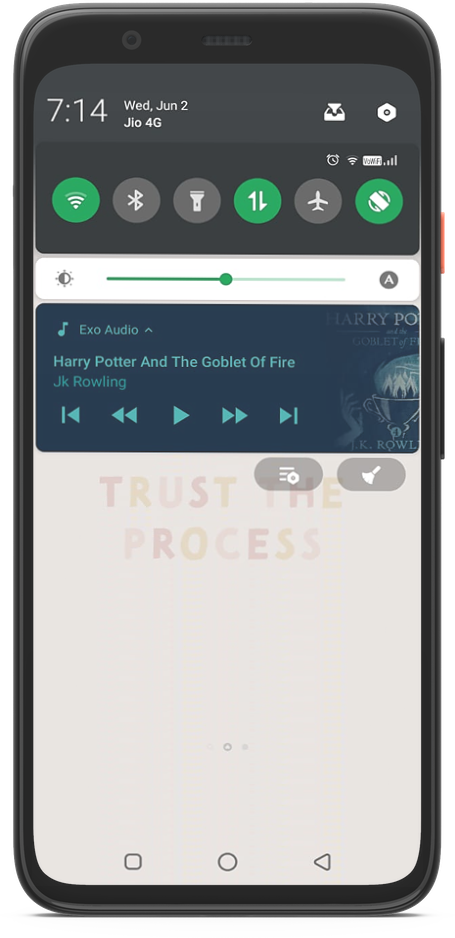

# exo-audio
A simple app implementing exo player with MVVM using firebase, dagger hilt and android architecture components

<h1>Screenshots : </h1>

<i>HomeFragment : </i>

</img>

<i> SongFragment : </i>

</img>

<i> Notifications : </i> 

</img>
